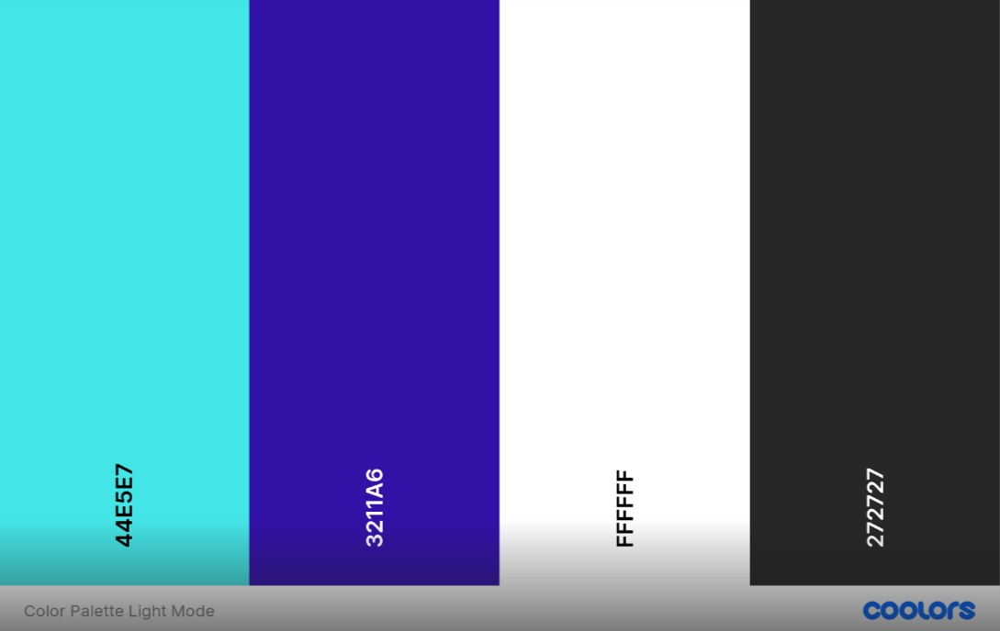
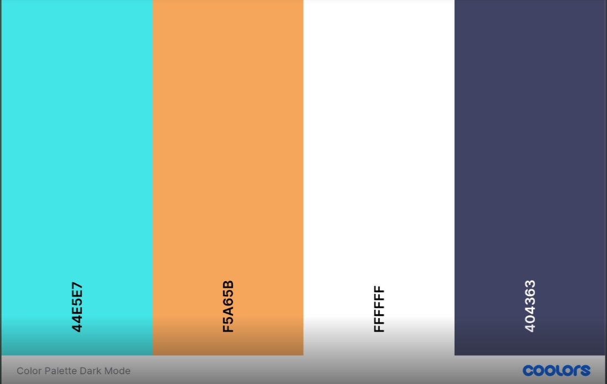
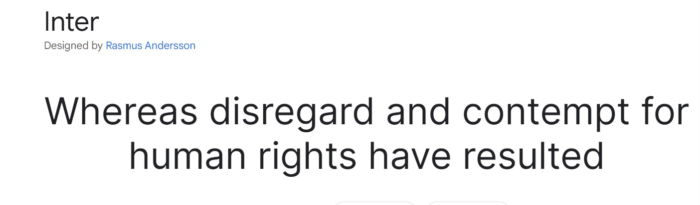
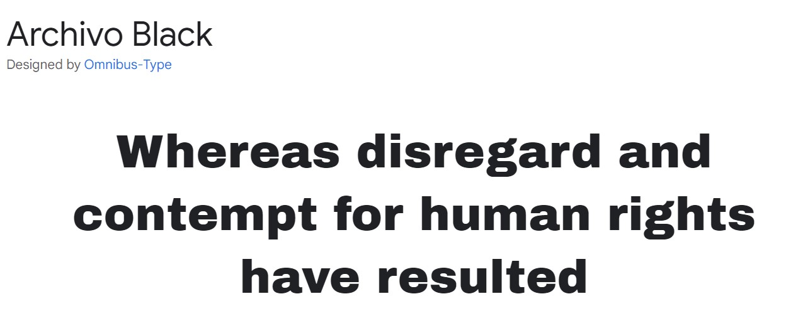
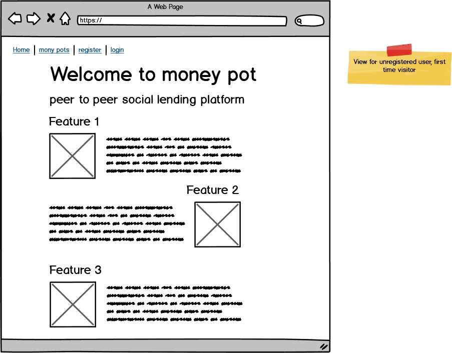
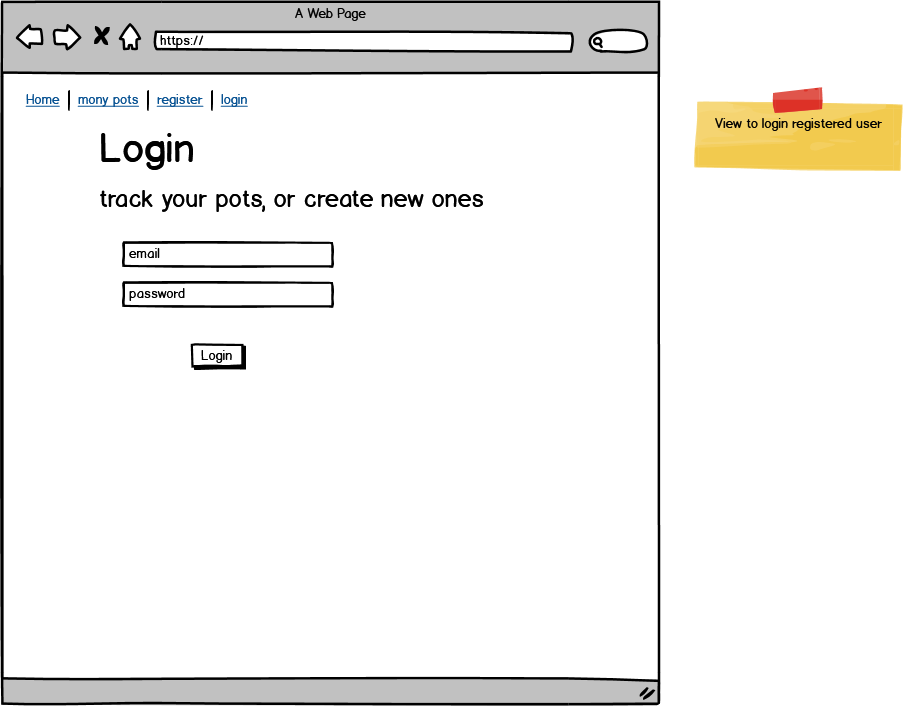
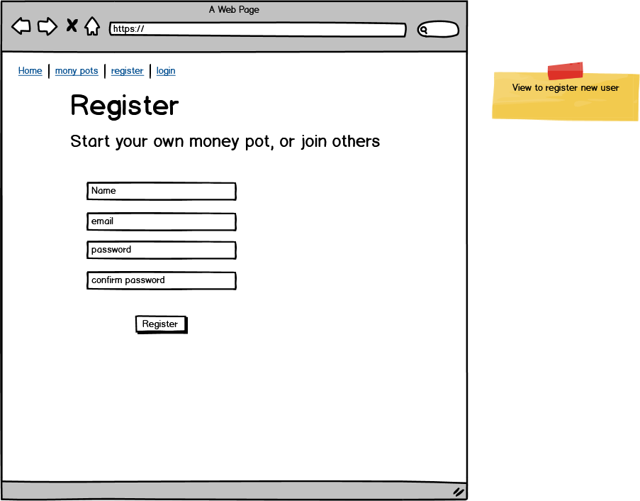

Basic flask app template

This template includes:

flask
template folder
static folder
css folder
js folder
base html template
main html template
base css file
base js file
requirements.txt

you need to create a file (on the same level as readme file) named "env.py" and put these contents in this file for the app to work:

> import os

> os.environ.setdefault("IP", "0.0.0.0")  
> os.environ.setdefault("PORT", "5000")  
> os.environ.setdefault("SECRET_KEY", "THisIsMySecretKey")  

All static files are linked to base html template, main html template inherets from base

to run the live server, run the following command in the terminal:
> python3 app.py

### Tailwind Installation Guide
Tailwind is added with the NPM (Node Package Manager), To be able to use it on your machine you need to have Node.js installed:

Download Node.js [here](https://nodejs.org/en/)

After Node.js is installed, install the Tailwind by running the following command in the terminal from the roof of the project:

> npm install

To compile Tailwind to work during development use command:

> npx tailwindcss -i ./static/src/input.css -o ./static/css/output.css --watch

For faster development, npm script has been added. Run command:

>  npm run watch

# RevFinance

RevFinance was developed as part of the January 2023 Hackathon: New Years Revolutions: Revolutionising finance for 2023! Presented by Code Institute.

## Team Name: Loan Sharks

[View Deployed Project Here](https://moneypot.onrender.com)

## Contents

* [User Experience (UX)](#user-experience)
  * [User Stories](#user-stories)
* [Technology](#technology)
* [Design](#design)
  * [Color Scheme](#color-scheme)
  * [Typography](#typography)
  * [Imagery](#imagery)
  * [Wireframes](#wireframes)
* [Deployment & Usage](#deployment)
* [Testing](#testing)
* [Credits](#credits)
  * [Code](#code)
  * [Content](#content)
  * [Media](#media)
  * [Acknowledgements](#acknowledgements)

## About

RevFinance is a social lending platform that allows users to create and manage money pots for saving towards specific goals. Users can create public pots that others can join and contribute to, as well as private pots where only invited users can participate. The platform also allows users to track the progress of their pots, edit the details of their pots, and join other users' public pots. RevFinance is a community-driven platform that makes it easy to save and reach your financial goals.

## User Experience

When designing the user experience for RevFinance, we considered several key paradigms of user experience to ensure that the platform is intuitive, easy to use, and meets the needs of users.

1. Navigation: The platform has a clear and simple navigation system that allows users to easily find and access the features they need.

2. Usability: The platform has been designed with usability in mind, making it easy for users to understand how to use the features and complete tasks.

3. Accessibility: The platform has been designed to be accessible to users of all abilities, including those with disabilities.
  - Contrast and color considerations: The website has a high contrast design, making it easy to read for users with visual impairments, and color schemes have been chosen to ensure that information is conveyed clearly and effectively.
  - Semantic HTML: The website uses semantic HTML which helps users with assistive technologies understand the website's structure and layout.

4. Personalization: The platform allows users to personalize their experience by creating and managing their own money pots, and join other people's pots if public.

5. Security: User's data is kept secure and private, and the platform is designed to protect against unauthorized access.

6. Consistency: The platform maintains a consistent design throughout, making it easy for users to understand the layout and find what they need.

7. Flexibility: the platform allows users to create and manage public and private pots, giving them flexibility to save money for a specific goal with others or privately.

### User stories

As a first time user: 

- I want to be able to create an account so that I can use the platform's features.

- I want to be able to explore the website and understand how it works before creating an account.

- I want to be able to create a public or private money pot easily, so that I can start saving - 
  towards my financial goals.

- I want to be able to join public money pots created by other users, so that I can contribute 
  towards their goals.

As a registered user: 

- I want to be able to easily log in to my account so that I can access my money pots and track my progress.

- I want to be able to view my account details and update my profile information if necessary.

- I want to be able to easily create a new money pot and invite friends and family to join it.

- I want to be able to view all of my money pots and see the progress I'm making towards my goals.

- I want to be able to edit or delete my money pots if necessary.

- I want to be able to join other public money pots created by other users, so that I can contribute towards their goals.

- I want to be able to see the list of people who joined my money pots, and see the contributions they made.

- I want to be able to withdraw my money from the money pot and use it for my goal

- I want to be able to leave a pot if I want to.

## Technology:

*  Languages:

    * HTML - Implemented as markdown language
    * CSS - Implemented to add style and layout of the website.
    * JavaScript - Implemented to add interactivity and secutiry. 
    * Python - 

* Frameworks, Libraries & Programs Used:

  * [Tailwind](https://tailwindcss.com/) - user as a CSS framework to add style and layout.
  * [Flask](https://flask.palletsprojects.com/en/2.2.x/) - Foundation of the site.
  * [Balsamic](https://balsamiq.com/) - used to generate wireframes.
  * [Git](https://git-scm.com/) - was used for the version control of the website.
  * [GitHub](https://github.com/) - was used to host the code of the website.
  * [Chrome DevTools](https://developer.chrome.com/docs/devtools/open/) - used to debug the website. 
  * [Am I Responsive?](http://ami.responsivedesign.is/) - To show the app on various devices.
  * [Render](https://render.com/) - To deploy our website.

## Initial MVP idea:

* Initial Ideas:
   
   1. Exchange different rates solutions for people travelling/investing/spending in different countries. For example, the app could suggest a good time to travel if the current exchange rate is low.

   2. Social lending platform where a group of people could put money into the pot towards a similar "goal" / plan. For example, if one plan for holidays but cannot afford it now, one could pay 100 pounds every week/fortnight to the pot with 5 - 10 other people and collect the needed amount for the trip. The goal would be to save money for everyone paying into that pot to achieve a similar goal.

   3. Money spending app where the user could track/monitor their spending and add money spent to a specific category. Money spending prediction for the current month and then the app could show how much money we saved or went over.

### Actual idea & content:

RevFinance

1. As a team, we would start by defining the scope and goals of the project, and creating a detailed project plan that outlines the tasks (GitHub task assignment) that need to be completed in order to bring the RevFinance platform to fruition. This plan would be divided into different phases, research and planning, design and development, testing and quality assurance, and deployment.

2. In the research and planning phase, we would conduct user research to understand the needs of our target audience and figure out how could we connect an API to improve user experience. We would also create user personas and user stories to guide the design and development process.

3. In the design and development phase, we would use tools such as Balsamiq for wireframes and Tailwid to design the user interface and user experience of the platform. We would then use technologies such as HTML, CSS, JavaScript, and a framework such as Node.js to integrate Tailwind with our platform.

4. In the testing and quality assurance phase, we would use a variety of tools to test and validate the platform, including manual testing. We would also conduct accessibility testing to ensure that the platform is usable for people with disabilities.

5. In the deployment, we would deploy the platform to a production environment (Render), and monitor its performance and user engagement. We would also implement a process for tracking and addressing bugs and other issues that arise, and make updates and improvements to the platform as needed.

6. During the project, we would use GitHub Issues and use communication tools like Slack to manage the project and collaborate effectively as a team. As we proceed, we will also use version control tools like Git to keep track of the changes made to the codebase.

*  The initial sketches and plans for the project align well with the final product. The sketches and plans likely included the overall layout and design of the platform, as well as key features such as the ability to create and manage money pots, track progress, join or invite others to join, and see the list of people who joined the money pots.

* Overall, the initial sketches and plans provided a solid foundation for the development of the RevFinance platform and were refined and iterated on throughout the development process.

## Design

### Color Scheme:

* Han blue is a traditional Chinese color that symbolizes stability and trust. This color can evoke feelings of reliability and security, which are important for a financial platform like RevFinance where users are entrusting their money.

* Fluorescent blue is a bright and vibrant color that can create a sense of energy and excitement. This color can be used to create a sense of urgency and encourage users to take action, which can be beneficial when it comes to encouraging users to save money and reach their financial goals.

* White color is used as a neutral background color, which makes it easy to read the text on the website and it creates a clean and professional look and feel. It also gives an open, spacious feeling to the website design, making it easy to navigate.

 

### Typography:

* Inter font was specifically chosen for the website's navigation bar because it is a versatile and minimalist font that is designed for digital screens. Its clear and legible design can help to create a sense of elegance, professionalism, and consistency in the navigation bar, making it easy for users to navigate the website and access the features they need. It also helps in creating a sense of simplicity and ease of use.

* Archivo Black is a geometric sans-serif font that is designed to be used in headings and titles, it is strong and bold, it can help to create a sense of hierarchy and importance. This font is perfect for highlighting important information, such as the title of money pots, the name of the user who created it and the amount of money raised.

### Imagery

### Wireframes

Desktop Wireframes

- - - 

## Deployment

- The app was deployed to [Render](https://render.com/).

## Testing

[Click Here](TESTING.md) to view the full testing procedure.

## Credits

### Code

### Content

Written by the developers

### Acknowledgements

* [Anthony O'Brien](https://github.com/auxfuse), our project facilitator.
* [CODE INSTITUTE](https://codeinstitute.net/), our event organizer.

